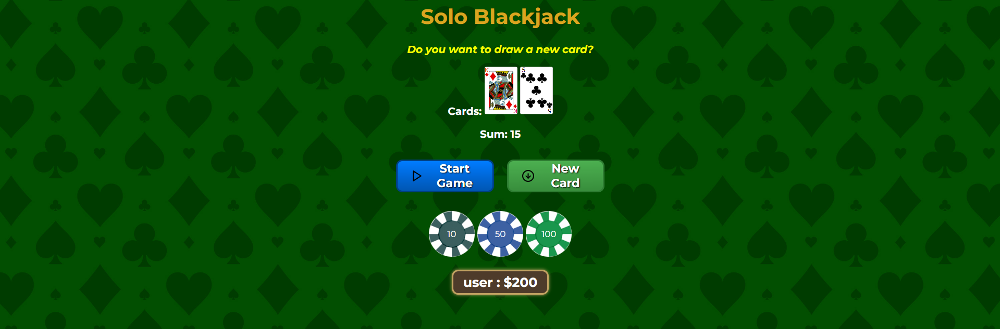

# Solo Blackjack Game

Blackjack is a popular card game typically played in casinos, where players aim to have a hand value closer to 21 than the dealer's without exceeding 21. 

This game is usually played against a dealer, but in this project, you'll need to play on your own :)

## Highlights:

Card Values: Number cards are worth their face value, face cards are worth 10, and Aces can be worth either 1 or 11. But in my game, Aces count as 11 :) 

Bust: If a player's hand exceeds 21, they lose the round, known as "busting."

## Process

1. When you enter the site, you'll be asked to enter a name. This is entirely optional. If you choose to enter your name, it will appear alongside your balance in the balance section."

2. I've set up 3 chips, which represent your bet amount. Before starting the game, you'll need to choose one of these chips. Once you've made your selection, you can begin the game.

3. If you've started the game and it's still ongoing, and you try to change your bet, you'll receive an error saying "You can't change your bet during an ongoing game!"

4. If you lose with the bet amount you selected, that amount will be deducted from your balance. If you win, double the amount will be added to your balance.

5. If you reach blackjack or bust and then click the new card button, you'll receive an error saying "You need to start the game before drawing a card."

## Materials I used

[Scrimba](https://scrimba.com) : I learned how to make a Blackjack game in JavaScript from Scrimba and received help from there.

## Attribution

- The background image used in this project is provided by [Freepik](https://www.freepik.com) under a free license.
- The design of the chips used in this project was sourced from [itch.io](https://mehrasaur.itch.io/3d-poker-pack) and is licensed under the [CC0 License](https://creativecommons.org/publicdomain/zero/1.0/).
- The icons used in the buttons of this project were sourced from [Feather Icons](https://feathericons.com/).

